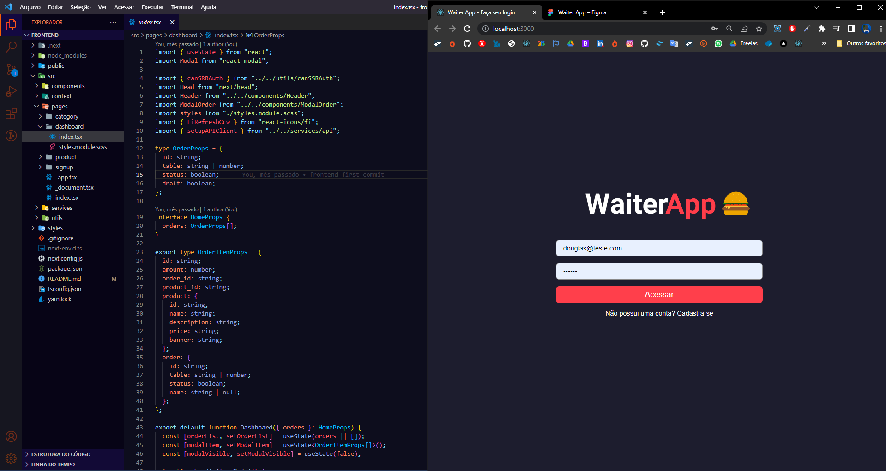

# WAITER APP

  

 

## Objetivo:

### Foi criar um sistema completo para garçons do zero, desde do backend, sistema web e aplicativo mobile, usando as tecnologias mais moderna presente no mercado.

## Descrição:

### Sobre as tecnologias utilizadas.

- `Foi criado com Next JS + typescript.`
- `Utilizado sass para estilização.`

### O sistema web vai ser responsável por.

- `Criar o estabecimento do usuário, com login e senha por autenticação usando token JWT.`
- `Criação das categorias.`
- `Criação dos produtos.`
- `Dashboard para controle do fluxo de pedidos.`
- `Finalizar o pedido.`

## <i>Douglas Monteiro</i> 😁🔥🚀
